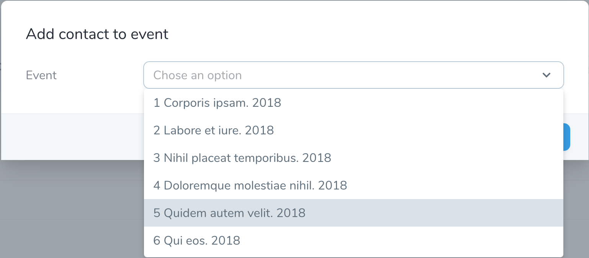

# Select Auto-Complete

[](https://packagist.org/packages/techouse/select-auto-complete)
[](https://packagist.org/packages/techouse/select-auto-complete)
[](https://packagist.org/packages/techouse/select-auto-complete)
[](https://packagist.org/packages/techouse/select-auto-complete)
[](https://www.codacy.com/manual/techouse/select-auto-complete?utm_source=github.com&amp;utm_medium=referral&amp;utm_content=techouse/select-auto-complete&amp;utm_campaign=Badge_Grade)
[](https://github.com/techouse/select-auto-complete/stargazers)


##### An auto-completing Laravel Nova search field.

Provides a capability of auto-completed searching for results inside a select input field.




## Installation

You can install the package in to a Laravel app that uses [Nova](https://nova.laravel.com) via composer:

```bash
composer require techouse/select-auto-complete
```

## Usage

The API is extends [Nova's default `Select` Field](https://nova.laravel.com/docs/1.0/resources/fields.html#select-field) by adding these additional options:
* __default__ - _OPTIONAL_ - Set the default __value__ in case of an empty field. Default is `null`.
* __maxResults__ - _OPTIONAL_ - Number of results to show at a time. Has to be a positive __integer__. Default is `30`.
* __maxHeight__ - _OPTIONAL_ - Height of select dropdown list. Default is `220px`.

Simply use `SelectAutoComplete` class instead of `Select` directly or alias it like the example below so you won't have to refactor too much existing code.

```php
<?php

namespace App\Nova\Actions;

use App\AccountData;
use Illuminate\Bus\Queueable;
use Laravel\Nova\Actions\Action;
use Illuminate\Support\Collection;
use Laravel\Nova\Fields\ActionFields;
use Illuminate\Queue\SerializesModels;
use Illuminate\Queue\InteractsWithQueue;
use Illuminate\Contracts\Queue\ShouldQueue;
use Techouse\SelectAutoComplete\SelectAutoComplete as Select;

class EmailAccountProfile extends Action
{
    use InteractsWithQueue, Queueable, SerializesModels;

    /**
     * Perform the action on the given models.
     *
     * @param  \Laravel\Nova\Fields\ActionFields  $fields
     * @param  \Illuminate\Support\Collection  $models
     * @return mixed
     */
    public function handle(ActionFields $fields, Collection $models)
    {
        foreach ($models as $model) {
            (new AccountData($model))->send();
        }
    }

    /**
     * Get the fields available on the action.
     *
     * @return array
     */
    public function fields()
    {
        return [
            Select::make(__('Person'), 'person')
                  ->options(\App\Person::all()->mapWithKeys(function ($person) {
                      return [$person->id => $person->name];
                  }))
                  ->displayUsingLabels(),
                  
            Select::make(__('Partner'), 'partner')
                  ->options(\App\User::all()->pluck('name', 'id'))
                  ->displayUsingLabels()
                  ->default(7)         // set the default to the User with the ID 7
                  ->maxResults(5)      // limit the dropdown select to a max of 5 hits
                  ->maxHeight('100px') // limit the dropdown to a max height of 100px
                  ->required()         // make the field required
        ];
    }
}
```
